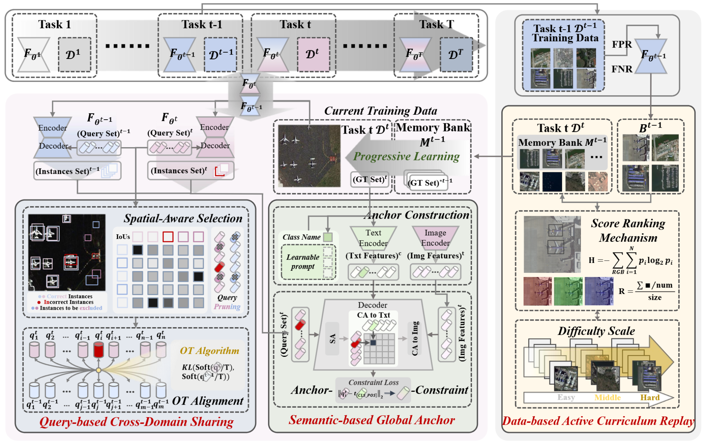
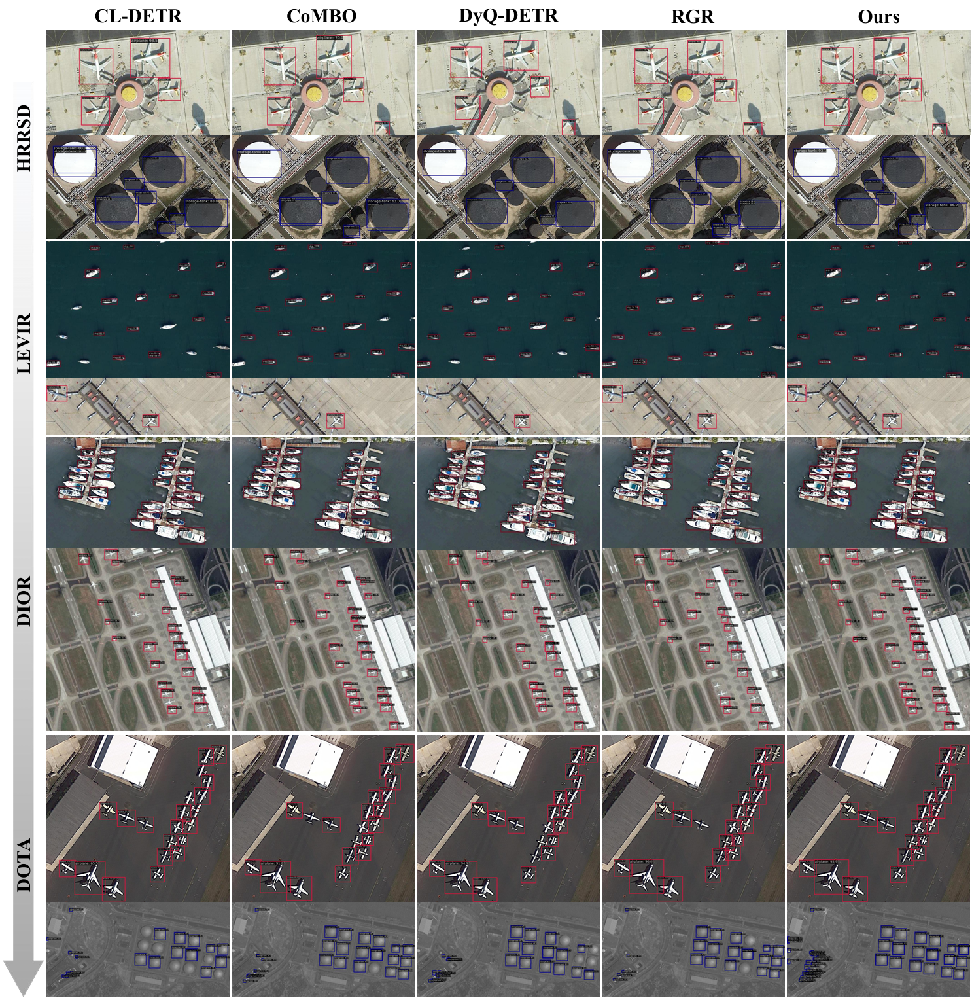

# Learning-to-Remember-Across-Domains-for-Remote-Sensing-Incremental-Object-Detection

## Intorduction

**Remote Sensing Domain-Incremental Object Detection (RS-DIOD)** is a highly challenging yet practical task. In real-world Earth observation applications, models must continuously learn from newly collected data across different geographical regions, sensors, or weather conditions (i.e., new domains) without forgetting previously acquired knowledge. 

Conventional incremental learning methods often struggle in this scenario due to severe inter-domain distribution shifts and extreme background dominance inherent in remote sensing imagery. To tackle these unique bottlenecks, we propose a novel framework named **L2RAD (Learning to Remember Across Domains)**.

L2RAD achieves a delicate balance between plasticity (learning new domains) and stability (retaining old domains) through a synergistic design of data-centric and architecture-centric strategies:

- 🧠 **Active Curriculum-based Exemplar Replay (ACER):** A data-centric module that dynamically manages hard, domain-sensitive exemplars to mitigate background dominance and bridge domain gaps.
- 🔄 **Cross-Domain Sharing (CDS):** An optimal transport-based distillation mechanism that aligns instance representations across domains, ensuring the model learns robust, domain-invariant features rather than rigidly mimicking teacher outputs.
- ⚓ **Semantic-based Global Anchor (SGA):** A text-driven structural constraint that prevents long-term semantic representation drift during continuous learning.

Extensive experiments across multiple remote sensing benchmarks (including HRRSD, DIOR, DOTA, LEVIR, etc.) demonstrate that L2RAD significantly outperforms existing state-of-the-art methods, providing a robust and scalable foundation for continuous learning in complex remote sensing environments.



## Quick Start
Our codebase is built upon the popular [MMDetection](https://github.com/open-mmlab/mmdetection) framework. The training and testing procedures follow the standard MMDetection style.

### 1. Data Preparation
Please refer to [DATA_PREPARATION.md](docs/DATA_PREPARATION.md) for downloading and organizing the remote sensing datasets (HRRSD, LEVIR, DIOR, DOTA, etc.). The data should be organized in the `data/` directory as follows:
```text
L2RAD/
  ├── data/
  │   ├── HRRSD/
  │   ├── LEVIR/
  │   ├── DIOR/
  │   └── ...
  ├── configs/
  ├── tools/
  └── ...
```

### 2. Training
Since L2RAD tackles domain-incremental object detection, the model is trained sequentially across different domains.

**Single GPU Training:**

```bash
# Step 1: Train on the 1st domain (e.g., HRRSD)
python tools/train.py configs/l2rad/seq1_step1_hrrsd.py

# Step 2: Incremental learning on the 2nd domain (e.g., LEVIR)
# The checkpoint from Step 1 will be automatically loaded as the teacher/initial weights
python tools/train.py configs/l2rad/seq1_step2_levir.py
```

**Multi-GPU Distributed Training:**
```bash
# Format: bash tools/dist_train.sh ${CONFIG_FILE} ${GPU_NUM}
bash tools/dist_train.sh configs/l2rad/seq1_step1_hrrsd.py 8
bash tools/dist_train.sh configs/l2rad/seq1_step2_levir.py 8
```

### 3. Testing & Evaluation
You can evaluate the trained model on a specific domain or perform a Joint Test (evaluating on the union of all encountered domains to measure anti-forgetting capability).

**Test on a single dataset:**

```bash
# Format: bash tools/dist_test.sh ${CONFIG_FILE} ${CHECKPOINT_FILE} ${GPU_NUM} --eval bbox
bash tools/dist_test.sh configs/l2rad/seq1_step2_levir.py \
    work_dirs/seq1_step2_levir/latest.pth 8 --eval bbox
```

**Joint Test (Comprehensive Evaluation):**
To evaluate the overall cross-domain generalization and catastrophic forgetting mitigation after training on multiple domains:
```bash
# Use the joint test config which includes the combined test sets
bash tools/dist_test.sh configs/l2rad/joint_test_seq1.py \
    work_dirs/seq1_step4_final/latest.pth 8 --eval bbox
```
